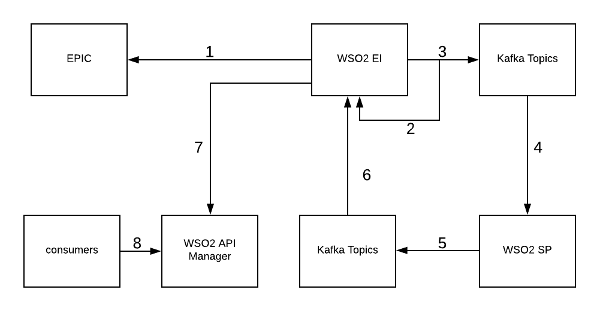
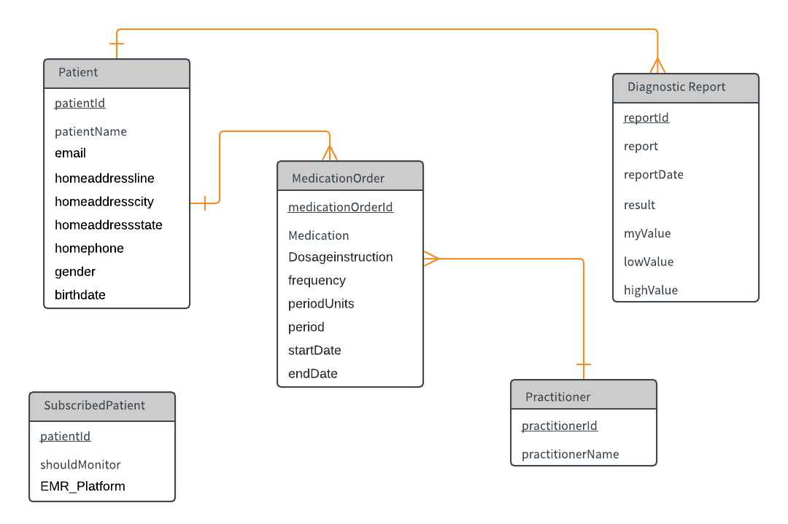

## Health-care Notification Platform

##### Used Products : WSO2 EI 6.3.0 , WSO2 SP 4.2.0 , WSO2 APIM 2.5.0
##### Used Extensions : WSO2 EI EPIC CONNECTOR 1.0.0 

### Overview

Note: Current Implementation only supports  EPIC systems (FHIR-DSTU2).

This is a Simple Implementation of Realtime Healthcare-Notification Platform. Find below diagram to understand the flow of this solution.



**Step 1 : WSO2 EI fetches data from EHR systems(EPIC Sandbox in this case).** 

Since EPIC follows patient-centric FHIR standards, storing of Patient Ids in a database is a prerequisite. In this particular solution, Patient Ids are collected from a Subscriber Interface.

Data polling is done by WSO2 EI Scheduled Tasks . Each Schedule Task executes Sequence. Each Sequence is used to fetch some Unique data. Currently fetches Observation EMRs and  Medication Order EMRs.(Interval:12h count :-1)

This is built as a Mock service and in production can have better ways to data retrieval.

Find Below table for the Sequences and what they are fetching.

| Code|Observation| Sequence Involve|
| ------------- | ------------- |----------|
| 718-7  | Blood Hemoglobin  |EPIC_DATA_POLL_HB_OBSERVATION_SEQUENCE|
| 2823-3  | Blood Potassium  |EPIC_DATA_POLL_POTASSIUM_OBSERVATION_SEQUENCE|
|2345-7 | Blood Glucose | EPIC_DATA_POLL_GLUCOSE_OBSERVATION_SEQUENCE|
|2093-3|Blood Cholesterol| EPIC_DATA_POLL_CHOLESTEROL_OBSERVATION_SEQUENCE|

##### EPIC APIS Used 
Use [WSO2 ESB EPIC Connector](https://store.wso2.com/store/assets/esbconnector/details/face7568-3bcd-4f10-882e-2941c6528df7) for execute EPIC APIs. Below synapse configuration sample shows Epic Observation operation
```xml
<epic.searchObservation>
    <patient>{$ctx:id}</patient>
    <code>718-7</code>
</epic.searchObservation>
```

* {$ctx:id}: Patient Id fetched from DB
* code 	 : These are the International codes for Healthcare Observations.( https://loinc.org )	


In addition EPIC_DATA_POLL_MEDICATION_ORDER_SEQUENCE for fetching Medication Orders.

#### Database Schema


   

**Step 2 : WSO2 EI validates retrieved responses.**

Here WSO2 EI validates whether responses can be categorized under below types. 

**Response Validation**

EPIC has predefined Error responses and Error Codes. Used those for validations.
4101 = Resource request returns no results
4100 = The resource request contained an invalid parameter

I checked only for 4101 since patient Ids are valid always.
Only Valid Responses are pushed to Kafka Streams.


**Step 3:  Send the validated responses to Kafka topics.**

##### Input Streams

* hemoglobin-epic =>  Stream for blood Hemoglobin related Data
* Medication-order-epic => Stream for Active Medication Order related Data
* cholesterol-epic =>  Stream for blood cholesterol related Data
* glucose-epic  => Stream for blood Glucose related Data
* potasium-in-blood-epic => Stream for blood potassium related Data


**Step 4:  SP retrieves records and generate alerts**

Create and Deploy Business Rules using below Templates.

##### SP Templates Involve


| Template Name|Task|
| ------------- | ------------- |
| Analyze Observation Reports  | Analyze Observation EMR for Abnormalities.  |
| Sending ABNORMAL Report Alerts  | Push Generated Abnormal Observation Alerts to Output Kafka streams    |
|Analyzing Medication Orders | Analyze Active Medication Orders from EMRs. |
|Sending Active Medication Order Alerts|Push Generated Active Medication Orders to Output Kafka Streams.(medication-order-epic-alert)|


**Step 5 : Publish processed alerts to Kafka Topics.**

##### Output Kafka Streams

* bloodhemoglobin-epic-alert   =>  Stream for blood Hemoglobin related alerts
* medication-order-epic-alert  => Stream for Active Medication Order related alerts
* bloodglucose-epic-alert    => Stream for blood Glucose related alerts
* bloodpotasium-epic-alert  => Stream for blood potassium related alerts
* Bloodcholesterol-epic-alert  =>  Stream for blood cholesterol related alerts

**Step 6 : WSO2 EI subscribed Output Kafka Streams and Enriches Alerts before storing it in the Database.**

Since SP generates simple specific Alerts, enrichment is necessary. Just contain relevant data only. Report type, Values,Sender Email , Patient Id etc.

After Enrichment It adds additional data to the alert before saving it on the DB.

Additional Data : Fetched from EPIC (eg: Patient Contact Info. / Practitioner Info )

Call Ex. APIs to fetch data 
* https://open-ic.epic.com/FHIR/api/FHIR/DSTU2/Patient/{ID}
```
<epic.searchPatient>
    <id>{$ctx:uri.var.patientid}</id>
</epic.searchPatient>
```


* https://open-ic.epic.com/FHIR/api/FHIR/DSTU2/Practitioner/{ID}
```xml
<epic.readById>
    <type>Practitioner</type>
    <id>{$ctx:uri.var.prescriberId}</id>
</epic.readById>
```

Checks report Id / medicationOrderIds  existence  in the DB before inserting. (Overcome from Data Redundancy Issues) - DiagnosticReport and MedicationOrder Tables will be affected.


**Step 7 : Stored Alerts are  exposed by EI Data Services.**
Alert data are exposed as RESTful APIs. These are not recommended to be used as public APIs. Just for the backend services for APIM.

**Step 8 : EPIC Healthcare Alert APIs are Exposed via WSO2 APIM**
3rd Party Consumers can use these Alerts for developing their own Healthcare Alert systems.

#### APIs Providing

##### Diagnostic Alert Related APIs (Potential consumers = Patients / Practitioners )

* [GET]/DiagnosticAlertDataService/allreports
    * Retrieves All the diagnostic alerts
* [GET]/DiagnosticAlertDataService/reports/patient/{patientId}
    * Retrieve all the Diagnostic Alert reports corresponding to specific patient given by patientId
* [GET]/DiagnosticAlertDataService/reports/bloodglucose/patient/{patientId}
    * Retrieve all the Diagnostic Alert reports regarding blood glucose corresponding to specific patient given by patientId
* [GET]/DiagnosticAlertDataService/reports/bloodpotasium/patient/{patientId}
    * Retrieve all the Diagnostic Alert reports regarding blood potassium corresponding to specific patient given by patientId
* [GET]/DiagnosticAlertDataService/reports/bloodhemoglobin/patient/{patientId}
    * Retrieve all the Diagnostic Alert reports regarding blood hemoglobin corresponding to specific patient given by patientId
* [GET]/DiagnosticAlertDataService/reports/bloodcholesterol/patient/{patientId}
    * Retrieve all the Diagnostic Alert reports regarding blood cholesterol corresponding to specific patient given by patientId
* [GET]/DiagnosticAlertDataService/reports/patient/{patientId}/{date}
    * Retrieves all the diagnostic reports corresponding to specific patient with in a date

##### Medication Order Related APIs (Potential consumers = Pharmacists / Practitioners )

* [GET]/MedicationOrderDataService/allmedicationorders
    * Retrieves all the active medication orders
* [GET]/MedicationOrderDataService/medicationOrders/patient/{patientId}
    * Retrieve all the Medication Reports corresponding to a specific patient given by patientId

##### Accessing Subscribed Patients (Potential consumers = Practitioners / Hospital admin)

* [POST]/RDBMSDataService/patient
    * Adding Patients who wants to be monitored to DB
* [GET]/RDBMSDataService/allpatients
    * Retrieves all monitoring patients
* [GET]/RDBMSDataService/allSelectedEpicPatients
    * Retrieves all Monitoring Epic Patients    
    
### Deployment Guide and Testing
    
* Click [here](./dist/wso2hc-1.0.0) for the Local Installation Guide.
* Click [here](./dist/docker-products) for the Docker Installation Guide.    

### Customizations and Extending the Solution

* All used EHR Data is based on [EPIC SandBox](https://open.epic.com/Clinical/FHIR?whereTo=patient).
Hence this solution is limited to very few resources and Analyze types.
* Find below the Basics of Analyzing EHRs and  Notification Generation.

    #### Product Configuration
    
    ##### WSO2 EI
    
    * Configure WSO2 EI for Data Services. Refer [Exposing a Datasource as a Data Service](https://docs.wso2.com/display/EI640/Exposing+a+Datasource+as+a+Data+Service).
    
    * Configure WSO2 EI for Apache KAKFA support. WSO2 EI need to play a role of a consumer and producer in this scenario. 
        
        * Kafka Producer - [Kakfa Connector](https://github.com/wso2-extensions/esb-connector-kafka/tree/org.wso2.carbon.connector.kafkaTransport-2.0.5/docs) 
        * Kafka Consumer - [Kafka Inbound Endpoint](https://github.com/wso2-extensions/esb-inbound-kafka/blob/org.apache.synapse.kafka.poll-1.0.5/docs/config.md)
            
    >If you are using kafka_2.x.x-0.8.2.0 or later, you also need to add the kafka-clients-0.8.x.x.jar file to the <EI_HOME>/lib  directory.
    If you are using a newer version of ZooKeeper, follow the steps below.
    > * Create a directory named conf inside the <EI_HOME>/repository directory.
    > * Create a directory named identity inside the <EI_HOME>/repository/conf directory.
    > * Add the jaas.conf file to the <EI_HOME>/repository/conf/identity directory. This is required because Kerberos authentication is enforced on newer versions of ZooKeeper.
    
    * Set offSet of Carbon.xml to 3 to avoid runtime port reusing.
    ```xml
      <offSet>3</offSet>
    ```
    
    * Add below two lines to **conf/axis2/axis2.xml** for getting **apllication/json+fhir** support.
       
    ```xml
      <!-- Under Message Formatters -->
      <messageFormatter contentType="application/json+fhir" class="org.wso2.carbon.integrator.core.json.JsonStreamFormatter"/>
    ```    
    
    ```xml
      <!-- Under Message Builders--> 
      <messageBuilder contentType="application/json+fhir" class="org.wso2.carbon.integrator.core.json.JsonStreamBuilder"/>
    ```  
    
    ##### WSO2 SP
    
    * Configure WSO2 SP for Apache KAFKA. Refer [Kafka transport Support](https://docs.wso2.com/display/SP430/Supporting+Different+Transports#SupportingDifferentTransports-KafkatransportKafka) 

    ##### WSO2 APIM
    
    * Set offSet of Carbon.xml to 10 to avoid runtime port reusing.
        ```xml
          <offSet>10</offSet>
        ```

    #### Data Polling 

    * Remember that the system is required to keep Patient Ids whom should be monitored.
    
    * Create individual Sequences for EHR Data Polling. eg: EPIC_DATA_POLL_HB_OBSERVATION_SEQUENCE for polling Blood Hemoglobin related data from EPIC systems.
    
    * Use separate Scheduled Tasks for executing the sequences. eg: EpicDataPollHbObservationTask
    
    * Use WSO2 EI [EPIC](https://store.wso2.com/store/assets/esbconnector/details/face7568-3bcd-4f10-882e-2941c6528df7) / [CERNER](https://store.wso2.com/store/assets/esbconnector/details/edfd56f2-cfa8-4ec1-b479-a89041cd1414) connectors for API operations.
    
    * Use [Loinc codes](https://loinc.org) for various blood observation observations. Use these codes for fetching various Observation Types. See **Epic APIS Used** section for further details. eg: 718-7 for Blood Hemoglobin Observation  
    
    * Use Proper validations for validating data. Use [EPIC FHIR Error Codes](https://open.epic.com/Clinical/FHIR?whereTo=patient)
    
    * Create individual Kafka topics for each observation type. Always remember to create two topics. One for persisting vanilla EHR Data and other for Normalize Notifications. eg: hemoglobin-epic for keep EHR data and bloodhemoglobin-epic-alert for keeping normalized alert data.
    
    #### Data Analyzing 
    
    * The particular solution is just analyzing basic Observation reports. Comparison of values is the simplest logic.
    
    * Refer [Siddhi Streaming SQL Guide](http://wso2.github.io/siddhi/documentation/siddhi-4.0/) for lean the basics of Siddhi SQL.
    
    * Notification Generation is done mainly by two Siddhi Apps. One is for Analyzing EHRs and other is for Alert Generation. Those apps are exposed as Stream processor Templates.
    Refer [Stream Processor Templates and Business Rules](https://docs.wso2.com/display/SP430/Working+with+Business+Rules) to learn on SP Templating and Business Rules.
    
    #### Data Visualization
    
    * Data visualization can be done several ways. Choose your own way. Find Below two suggestions.
    
    * Use Output Kafka Streams which contains processed Alerts or Use Enriched data persisted in DB as in this particular solution.
    
    * If go for 2nd option;Use persisted data in DB, use WSO2 EI for exposing data as [Data Services](https://docs.wso2.com/display/EI640/Exposing+a+Datasource+as+a+Data+Service) and use WSO2 APIM for [exposing APIS](https://docs.wso2.com/display/AM260/Quick+Start+Guide). Use provided **swagger.json** to take an idea.  